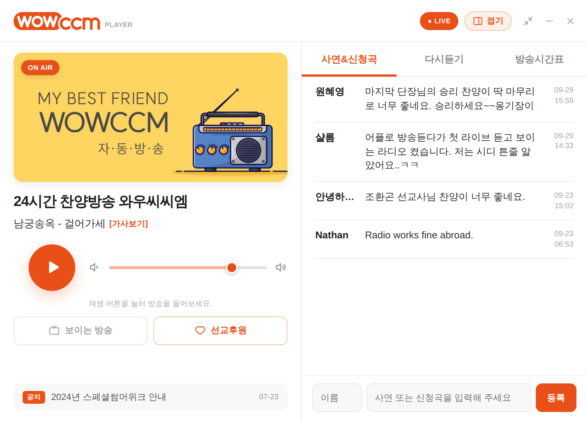
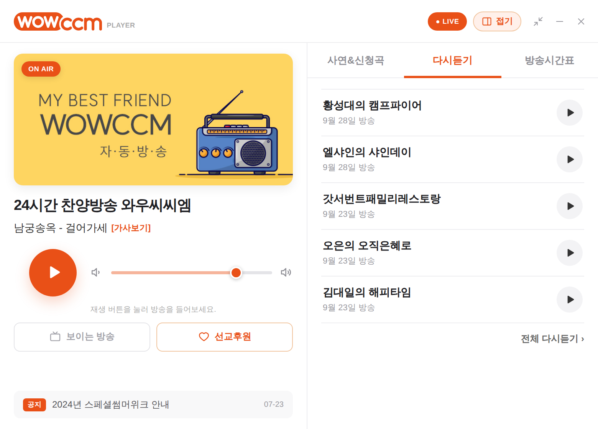
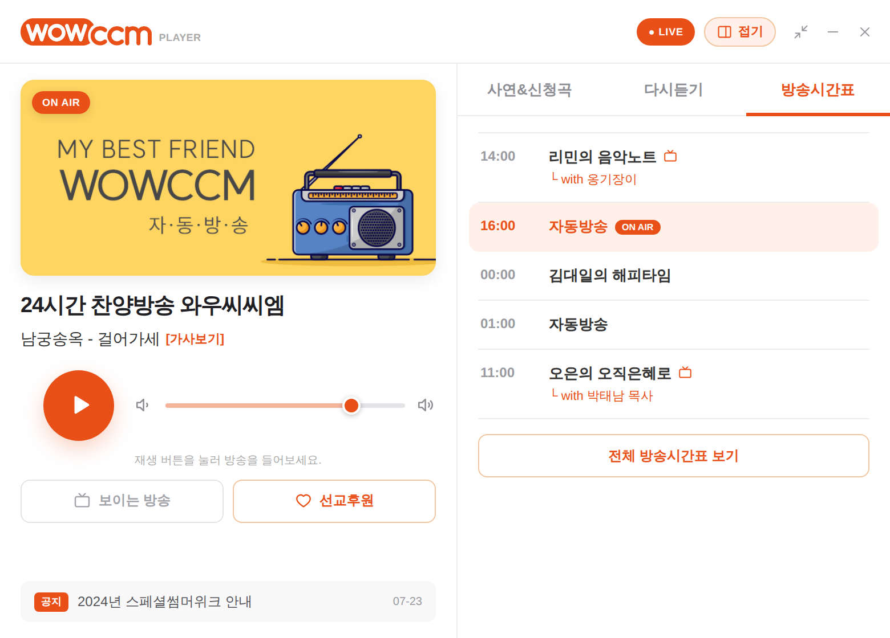
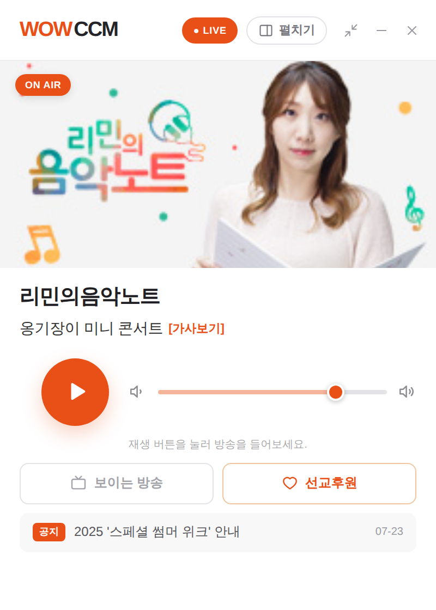
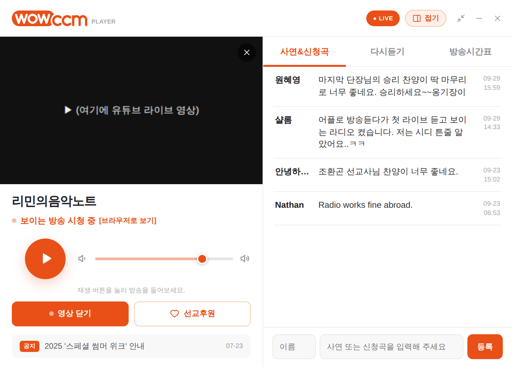
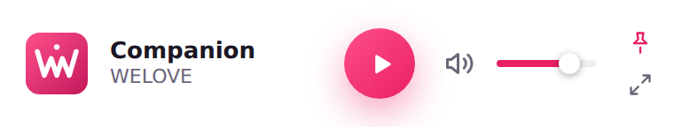

# WOWCCM 와플 (WOWCCM Wapl)

와우씨씨엠 24시간 찬양방송 데스크톱 플레이어입니다.
하나의 코드에서 **Windows 설치 파일(.exe)** 과 **Mac 설치 파일(.dmg)** 을 함께 만듭니다.

디자인은 와우씨씨엠 미니 페이지(`wowcast/wow_mini_test_v2.php`)의 분위기를 따릅니다.
화면 구성은 MBC mini, KBS 콩, SBS 고릴라 PC 플레이어처럼 **왼쪽은 플레이어, 오른쪽은 참여 창**입니다.



| 다시듣기 | 방송시간표 |
|---|---|
|  |  |

| 오른쪽 창을 접은 화면 | 보이는 방송 시청 중 |
|---|---|
|  |  |

미니 모드:



## 창 구성

| 모드 | 크기 | 내용 |
|---|---|---|
| 펼침 (기본) | 780 × 560 | 왼쪽 플레이어 + 오른쪽 사연&신청곡 / 다시듣기 / 방송시간표 |
| 접힘 | 400 × 560 | 플레이어만. 헤더의 **접기 / 펼치기** 버튼으로 바꾸며, 다음에 켤 때도 기억합니다. |
| 미니 | 380 × 72 | 가로 바. "항상 위에 표시"가 가능합니다. |

사연&신청곡은 채팅창처럼 **목록은 위, 입력창은 아래에 고정**됩니다.

## 기능

- **생방송 재생.** 정지 후 다시 누르면 지금 나오는 방송부터 이어집니다. 끊기면 자동으로 다시 연결합니다.
- **진행자 이미지·프로그램명·현재 곡** 자동 갱신. 곡명이 칸보다 길면 흘러갑니다. [가사보기] 링크도 있습니다.
- **사연&신청곡.** 목록 보기와 글 등록을 지원하고, 이름은 기억해 둡니다.
- **다시듣기.** 누르면 생방송이 멈추고 다시듣기가 재생됩니다. 같은 회차를 다시 누르면 일시정지되고, 한 번 더 누르면 이어 듣습니다.
- **방송시간표.** 지금 방송 중인 프로그램을 ON AIR로 표시합니다. 해외에서도 **한국 시각** 기준으로 판단합니다.
- **보이는 방송**(유튜브 라이브)·**선교후원** 바로가기
  - 보이는 방송 버튼은 **유튜브가 실제로 라이브 중일 때만 주황색**으로 켜지고, 평소에는 회색입니다. 2분마다 자동으로 확인합니다.
  - 확인 순서: ① 서버의 YouTube API 결과(`server/youtube_live.php`, 설치 방법은 [server/README.md](server/README.md)) → ② 유튜브 채널 페이지 직접 확인 → ③ 편성표
  - 켜져 있을 때 누르면 **플레이어 맨 위(진행자 사진 자리)에서 영상이 재생**됩니다.
    - 영상 소리와 겹치지 않도록 라디오 소리는 잠시 멈춥니다.
    - 영상을 닫으면(✕ 또는 "영상 닫기") 라디오가 다시 켜집니다.
    - [브라우저로 보기]를 누르면 유튜브(채팅 포함)를 브라우저에서 엽니다.
    - 영상은 wowccm.net의 `visible_embed.php`를 거쳐 불러옵니다. 설치형 앱은 웹사이트 주소가 없어 유튜브가 재생을 막을 수 있는데, 이 페이지를 거치면 wowccm.net에서 온 재생으로 인식되기 때문입니다. 이 파일이 없으면 유튜브 영상을 직접 불러옵니다.
  - 꺼져 있을 때 누르면 브라우저에서 유튜브 채널을 엽니다.
  - ①② 모두 실패하면 편성표의 📹(보이는 방송) 표시와 ON AIR로 대신 판단합니다.

- **공지.** 공지사항 게시판의 최근 글 5개가 한 줄씩 넘어가며, 누르면 해당 글이 열립니다.
- **미니 모드**와 "항상 위에 표시"
- **트레이 상주.** 닫기(✕)를 눌러도 트레이/메뉴바에서 계속 재생됩니다.
- 키보드 미디어 키와 스페이스바로 재생/정지
- 볼륨은 다음에 켤 때도 기억합니다. 프로그램을 두 번 실행하면 기존 창을 보여줍니다.

## 서버 데이터

모든 주소는 `src/config.ts`에 모여 있습니다. wowccm.net이 CORS 헤더를 주지 않아서, 앱에서는 Rust 쪽(`src-tauri/src/wow_api.rs`)이 대신 요청합니다. 요청은 wowccm.net 경로로만 제한됩니다.

| 데이터 | 주소 | 형식 |
|---|---|---|
| 프로그램명 | `/wowcast/wow_mini_test_v2.php?mini_program_status=1` | JSON |
| 현재 곡 | `/daeil/music5.php?song_check=1` | JSON |
| 진행자 이미지 | `/wowcast/dj5.php?check=1` | JSON |
| 사연 목록 | `/wowcast/wow_mini_test_v2.php?mini_request_list=1` | HTML 조각 |
| 사연 등록 | `POST /wowcast/wow_mini_test_v2.php` | JSON |
| 다시듣기·편성표 | `/wowcast/wow_mini_test_v2.php` 페이지 안의 `<template>` | HTML |
| 공지 | `/bbs/rss.php?bo_table=news` | RSS |
| 보이는 방송 여부 | `/wowcast/youtube_live.php` (YouTube API, 서버에 설치 필요) | JSON |
| 〃 (대체) | `https://www.youtube.com/@wowccm/live` (`src-tauri/src/youtube.rs`) | 유튜브 페이지 |

> 지금은 **시험용 페이지(`wow_mini_test_v2.php`)** 에 기대고 있습니다. 이 페이지의 이름이나 구조가 바뀌면 앱도 함께 고쳐야 합니다.
> 플레이어 전용 JSON 주소(예: `/wowcast/player_api.php`)를 하나 만들어 두면 훨씬 안전합니다.

## 개발

필요한 것: Node.js 22, Rust (stable).
Linux에서는 [Tauri 사전 준비](https://v2.tauri.app/start/prerequisites/)에 나오는 라이브러리도 설치해야 합니다.

```bash
npm install
npm run tauri dev      # 앱 창으로 실행
npm run dev            # 브라우저에서 화면만 확인 (http://localhost:1420)
npm test               # 화면 쪽 테스트 (사연·편성표 해석, ON AIR 판단)
cd src-tauri && cargo test
```

## 자동 업데이트

설치한 분들의 플레이어는 **켤 때 한 번, 그리고 켜 둔 동안 6시간마다** 새 버전이 있는지 확인합니다.
새 버전이 있으면 헤더 아래에 "새 버전이 나왔습니다 · **지금 업데이트**" 띠가 뜹니다. 누르면 받아서 설치한 뒤 플레이어가 다시 켜집니다.

- 새 버전 정보는 GitHub Releases의 **최신 정식판**에 들어 있는 `latest.json`에서 읽습니다. 시험판(`-test`)은 자동 업데이트 대상이 아닙니다.
- 업데이트 파일은 와우씨씨엠만 가진 **비밀 키로 서명**합니다. 플레이어는 공개 키(`tauri.conf.json`의 `pubkey`)로 서명을 확인한 뒤에만 설치합니다. 가짜 업데이트가 끼어들 수 없습니다.
- 비밀 키는 저장소의 **Settings → Secrets and variables → Actions**에 `TAURI_SIGNING_PRIVATE_KEY` 이름으로 등록해 둡니다. **비밀 키를 잃어버리면 이미 설치된 플레이어에 업데이트를 보낼 수 없으니** 안전한 곳에 따로 보관하세요.

### 새 버전을 내는 법

1. GitHub의 **Actions → 설치 파일 빌드 → Run workflow**를 누릅니다.
2. 태그에 **이전보다 높은 번호**를 넣고 실행합니다. 예: `v2.0.1`
   - 태그 번호가 그대로 앱 버전이 됩니다. 설정 파일은 따로 고치지 않아도 됩니다.
   - 시험판으로만 올리려면 `v2.0.1-test1`처럼 뒤에 `-`를 붙입니다. 이 경우 자동 업데이트로는 나가지 않습니다.
3. 15분쯤 지나 빌드가 끝나면, 설치한 분들에게 업데이트 알림이 뜹니다.

## 설치 파일 만들기

**자동 빌드 (권장).** 태그를 푸시하면 GitHub Actions가 Windows와 Mac 설치 파일을 만들어 Releases 초안에 올립니다.

```bash
git tag v2.0.0
git push origin v2.0.0
```

**직접 빌드.** 각 운영체제에서 `npm run tauri build`를 실행합니다.

- Windows: `src-tauri/target/release/bundle/nsis/*.exe`
- Mac: `src-tauri/target/release/bundle/dmg/*.dmg`

### 코드 서명

- **Mac:** 서명과 공증을 하지 않으면 "손상된 앱" 경고가 떠서 일반 사용자는 설치하기 어렵습니다. Apple 개발자 계정(연 $99)을 만든 뒤 `.github/workflows/release.yml`에 적힌 `APPLE_*` 값을 저장소 Secrets에 등록해 주세요.
- **Windows:** 서명하지 않으면 SmartScreen 경고("PC 보호")가 뜹니다. "추가 정보 → 실행"으로 설치할 수는 있습니다.

## 구조

```
src/                  화면 (React + TypeScript)
  config.ts           스트림 주소, 링크, 공지
  lib/usePlayer.ts    생방송·다시듣기 재생, 자동 재연결
  lib/api.ts          서버 데이터 읽기와 해석
  components/         화면 조각들
src-tauri/            데스크톱 앱 (Rust)
  src/lib.rs          트레이, 미니 모드, 창 닫기 처리
  src/wow_api.rs      wowccm.net 데이터 요청 (CORS 우회)
  src/now_playing.rs  곡 정보 서버가 안 될 때 스트림에서 곡 정보(ICY) 읽기
branding/             와플 아이콘 원본 그림 (npm run icons 로 모든 크기 생성, scripts/make_icons.py)
```

## Mac 서명·공증 (Apple 개발자 계정)

아래 6개 값을 저장소 **Settings → Secrets and variables → Actions**에 등록하면, 다음 빌드부터 Mac 앱에 서명하고 Apple 공증을 받습니다. 그러면 청취자 Mac에서 "확인되지 않은 개발자" 경고 없이 바로 열립니다. 값이 없으면 지금처럼 서명 없이 빌드합니다.

| 이름 | 넣을 값 | 받는 곳 |
|---|---|---|
| `APPLE_CERTIFICATE` | **Developer ID Application** 인증서(.p12)를 base64로 바꾼 글자 | Mac 키체인에서 내보내기 → 터미널 `base64 -i 인증서.p12 \| pbcopy` |
| `APPLE_CERTIFICATE_PASSWORD` | .p12를 내보낼 때 정한 비밀번호 | 직접 정함 |
| `APPLE_SIGNING_IDENTITY` | `Developer ID Application: 이름 (팀ID)` | 키체인에 보이는 인증서 이름 그대로 |
| `APPLE_ID` | Apple 개발자 계정 이메일 | |
| `APPLE_PASSWORD` | **앱 전용 암호** (로그인 비밀번호 아님) | https://account.apple.com → 로그인 및 보안 → 앱 전용 암호 |
| `APPLE_TEAM_ID` | 10자리 팀 ID | https://developer.apple.com/account → Membership |

- Developer ID 인증서는 개발자 계정의 **Account Holder(대표 관리자)** 만 만들 수 있습니다.
- 인증서 만들기: https://developer.apple.com/account/resources/certificates/add → **Developer ID Application**을 고릅니다. Mac의 키체인 접근에서 만든 인증서 요청 파일(CSR)이 필요합니다.
