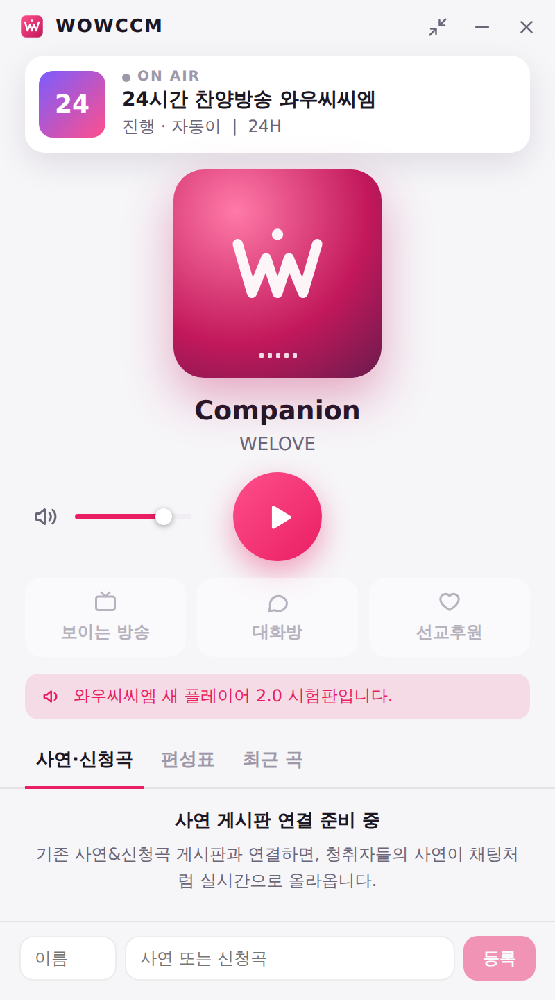
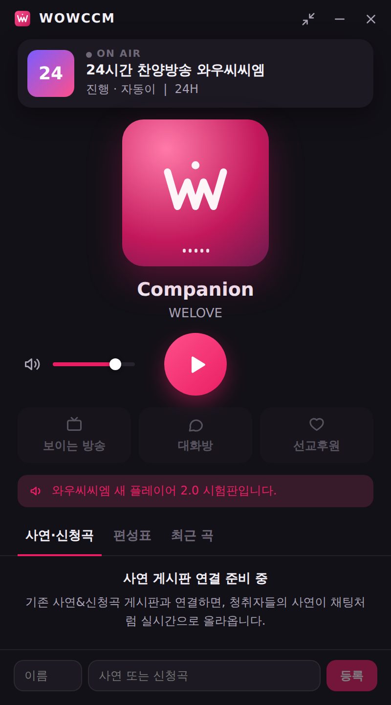

# WOWCCM Player 2.0

와우씨씨엠 24시간 찬양방송 데스크톱 플레이어입니다.
하나의 코드에서 **Windows 설치 파일(.exe)** 과 **Mac 설치 파일(.dmg)** 을 함께 만듭니다.

| 기본 화면 | 다크 모드 |
|---|---|
|  |  |

미니 모드:


## 지금 되는 것 (1단계)

- 실시간 방송 재생·정지, 볼륨, 음소거. 볼륨은 다음에 켤 때도 기억합니다.
- 정지했다가 다시 재생하면 **지금 나오는 방송부터** 이어집니다.
- 연결이 끊기면 자동으로 다시 연결합니다. 간격은 1초에서 시작해 최대 30초까지 늘어납니다.
- 현재 곡 정보 표시. 스트림의 ICY 메타데이터를 읽으며, UTF-8과 EUC-KR 인코딩을 모두 지원합니다.
- 최근에 흐른 곡 목록 (최대 30곡)
- 미니 모드와 "항상 위에 표시"
- 닫기(✕)를 눌러도 트레이/메뉴바에서 계속 재생됩니다. 트레이 메뉴에는 재생/정지, 열기, 종료가 있습니다.
- 키보드 미디어 키, 스페이스바로 재생/정지
- 시스템 설정에 맞춰 다크 모드가 자동 적용됩니다.
- 프로그램이 이미 실행 중이면 새로 켜지 않고 기존 창을 보여줍니다.

## 연동을 기다리는 것

`src/config.ts`에 주소를 넣으면 바로 동작하거나, 데이터 형식이 정해지면 붙일 부분입니다.

- [ ] 보이는 방송 / 대화방 / 선교후원 링크 → `LINKS`
- [ ] 공지 문구 → `NOTICES` (나중에 서버에서 불러오도록 변경 예정)
- [ ] 사연·신청곡 게시판 (조회·등록 방식 확인 필요)
- [ ] 편성표, 현재 프로그램 정보
- [ ] 배너 슬라이드 (유튜브 등)
- [ ] 취침 예약·알람, 자동 실행, 자동 업데이트

## 개발

필요한 것: Node.js 22, Rust (stable).
Linux에서는 [Tauri 사전 준비](https://v2.tauri.app/start/prerequisites/)에 나오는 라이브러리도 설치해야 합니다.

```bash
npm install
npm run tauri dev      # 앱 창으로 실행
npm run dev            # 브라우저에서 화면만 확인 (http://localhost:1420/?demo)
cd src-tauri && cargo test
```

## 설치 파일 만들기

**자동 빌드 (권장).** 태그를 푸시하면 GitHub Actions가 Windows와 Mac 설치 파일을 만들어 Releases 초안에 올립니다.

```bash
git tag v2.0.0
git push origin v2.0.0
```

**직접 빌드.** 각 운영체제에서 `npm run tauri build`를 실행합니다.

- Windows: `src-tauri/target/release/bundle/nsis/*.exe`
- Mac: `src-tauri/target/release/bundle/dmg/*.dmg`

### 코드 서명

- **Mac:** 서명과 공증을 하지 않으면 "손상된 앱" 경고가 떠서 일반 사용자는 설치하기 어렵습니다. Apple 개발자 계정(연 $99)을 만든 뒤 `.github/workflows/release.yml`에 적힌 `APPLE_*` 값을 저장소 Secrets에 등록해 주세요.
- **Windows:** 서명하지 않으면 SmartScreen 경고("PC 보호")가 뜹니다. "추가 정보 → 실행"으로 설치할 수는 있습니다.

## 구조

```
src/                  화면 (React + TypeScript)
  config.ts           스트림 주소, 링크, 공지
  lib/useRadio.ts     재생, 자동 재연결
  lib/useNowPlaying.ts 곡 정보 갱신, 최근 곡
  components/         화면 조각들
src-tauri/            데스크톱 앱 (Rust)
  src/lib.rs          트레이, 미니 모드, 창 닫기 처리
  src/now_playing.rs  스트림에서 곡 정보(ICY) 읽기
app-icon.svg          앱 아이콘 원본 (npm run icons 로 모든 크기 생성)
```
