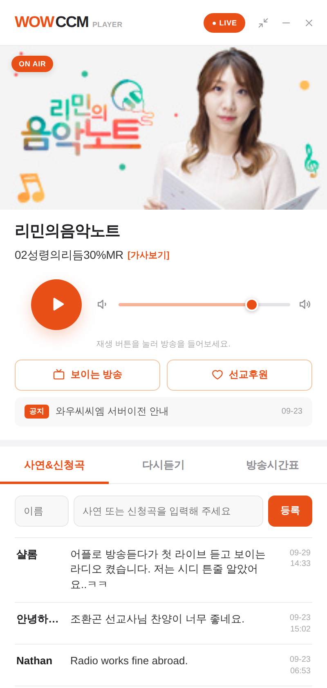

# WOWCCM Player 2.0

와우씨씨엠 24시간 찬양방송 데스크톱 플레이어입니다.
하나의 코드에서 **Windows 설치 파일(.exe)** 과 **Mac 설치 파일(.dmg)** 을 함께 만듭니다.

디자인은 와우씨씨엠 미니 페이지(`wowcast/wow_mini_test_v2.php`)의 분위기를 따릅니다.

| 사연&신청곡 | 다시듣기 | 방송시간표 |
|---|---|---|
|  |  |  |

미니 모드:


## 기능

- **생방송 재생.** 정지 후 다시 누르면 지금 나오는 방송부터 이어집니다. 끊기면 자동으로 다시 연결합니다.
- **진행자 이미지·프로그램명·현재 곡** 자동 갱신. 곡명이 칸보다 길면 흘러갑니다. [가사보기] 링크도 있습니다.
- **사연&신청곡.** 목록 보기와 글 등록을 지원하고, 이름은 기억해 둡니다.
- **다시듣기.** 누르면 생방송이 멈추고 다시듣기가 재생됩니다. 같은 회차를 다시 누르면 일시정지되고, 한 번 더 누르면 이어 듣습니다.
- **방송시간표.** 지금 방송 중인 프로그램을 ON AIR로 표시합니다. 해외에서도 **한국 시각** 기준으로 판단합니다.
- **보이는 방송**(유튜브 라이브)·**선교후원** 바로가기
- **공지.** 공지사항 게시판의 최근 글 5개가 한 줄씩 넘어가며, 누르면 해당 글이 열립니다.
- **미니 모드**와 "항상 위에 표시"
- **트레이 상주.** 닫기(✕)를 눌러도 트레이/메뉴바에서 계속 재생됩니다.
- 키보드 미디어 키와 스페이스바로 재생/정지
- 볼륨은 다음에 켤 때도 기억합니다. 프로그램을 두 번 실행하면 기존 창을 보여줍니다.

## 서버 데이터

모든 주소는 `src/config.ts`에 모여 있습니다. wowccm.net이 CORS 헤더를 주지 않아서, 앱에서는 Rust 쪽(`src-tauri/src/wow_api.rs`)이 대신 요청합니다. 요청은 wowccm.net 경로로만 제한됩니다.

| 데이터 | 주소 | 형식 |
|---|---|---|
| 프로그램명 | `/wowcast/wow_mini_test_v2.php?mini_program_status=1` | JSON |
| 현재 곡 | `/daeil/music5.php?song_check=1` | JSON |
| 진행자 이미지 | `/wowcast/dj5.php?check=1` | JSON |
| 사연 목록 | `/wowcast/wow_mini_test_v2.php?mini_request_list=1` | HTML 조각 |
| 사연 등록 | `POST /wowcast/wow_mini_test_v2.php` | JSON |
| 다시듣기·편성표 | `/wowcast/wow_mini_test_v2.php` 페이지 안의 `<template>` | HTML |
| 공지 | `/bbs/rss.php?bo_table=news` | RSS |

> 지금은 **시험용 페이지(`wow_mini_test_v2.php`)** 에 기대고 있습니다. 이 페이지의 이름이나 구조가 바뀌면 앱도 함께 고쳐야 합니다.
> 플레이어 전용 JSON 주소(예: `/wowcast/player_api.php`)를 하나 만들어 두면 훨씬 안전합니다.

## 개발

필요한 것: Node.js 22, Rust (stable).
Linux에서는 [Tauri 사전 준비](https://v2.tauri.app/start/prerequisites/)에 나오는 라이브러리도 설치해야 합니다.

```bash
npm install
npm run tauri dev      # 앱 창으로 실행
npm run dev            # 브라우저에서 화면만 확인 (http://localhost:1420)
npm test               # 화면 쪽 테스트 (사연·편성표 해석, ON AIR 판단)
cd src-tauri && cargo test
```

## 설치 파일 만들기

**자동 빌드 (권장).** 태그를 푸시하면 GitHub Actions가 Windows와 Mac 설치 파일을 만들어 Releases 초안에 올립니다.

```bash
git tag v2.0.0
git push origin v2.0.0
```

**직접 빌드.** 각 운영체제에서 `npm run tauri build`를 실행합니다.

- Windows: `src-tauri/target/release/bundle/nsis/*.exe`
- Mac: `src-tauri/target/release/bundle/dmg/*.dmg`

### 코드 서명

- **Mac:** 서명과 공증을 하지 않으면 "손상된 앱" 경고가 떠서 일반 사용자는 설치하기 어렵습니다. Apple 개발자 계정(연 $99)을 만든 뒤 `.github/workflows/release.yml`에 적힌 `APPLE_*` 값을 저장소 Secrets에 등록해 주세요.
- **Windows:** 서명하지 않으면 SmartScreen 경고("PC 보호")가 뜹니다. "추가 정보 → 실행"으로 설치할 수는 있습니다.

## 구조

```
src/                  화면 (React + TypeScript)
  config.ts           스트림 주소, 링크, 공지
  lib/usePlayer.ts    생방송·다시듣기 재생, 자동 재연결
  lib/api.ts          서버 데이터 읽기와 해석
  components/         화면 조각들
src-tauri/            데스크톱 앱 (Rust)
  src/lib.rs          트레이, 미니 모드, 창 닫기 처리
  src/wow_api.rs      wowccm.net 데이터 요청 (CORS 우회)
  src/now_playing.rs  곡 정보 서버가 안 될 때 스트림에서 곡 정보(ICY) 읽기
app-icon.svg          앱 아이콘 원본 (npm run icons 로 모든 크기 생성)
```
